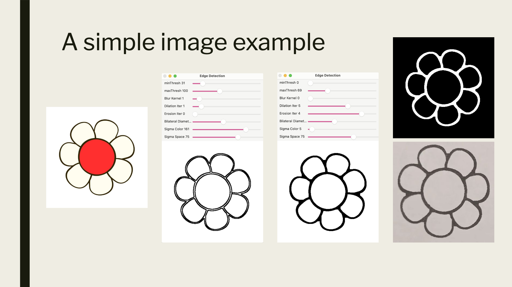

# Image to Rubber Stamp SVG Generator
 <br>

Created as a group project for my university's computer vision class.
This Python script takes a raster image, lets you live-tune Canny thresholds, Gaussian blur, and
line thickness via trackbars, then saves the preview as an SVG outline suitable for laser engraving.

# Requirements

Install the project dependencies listed in `requirements.txt`.
`pip3 install -r requirements.txt`

# Usage

```
python3 generate_svg.py
Enter the image path (e.g., 'images/image.jpg'): images/image.jpg
Enter height in inches: 5
Enter width in inches: 5
SVG saved as 'rubber_stamp.svg'
```

**NOTE:** *Press Esc or close the window to save when you're happy with how it looks in the preview window.*

This will load the specified image, resize it to fit within a working area while preserving aspect
ratio, and open an interactive preview window where you can adjust Canny thresholds, Gaussian blur,
and line thickness via trackbars. When you close the window or press Esc, the script exports the SVG
as rubber_stamp.svg. It will have a black engraved background, white raised design, and a thin red
border sized in millimeters for laser cutting around the bounding box. Depending on which lasercutter
software you are using, you might need to invert the vector.